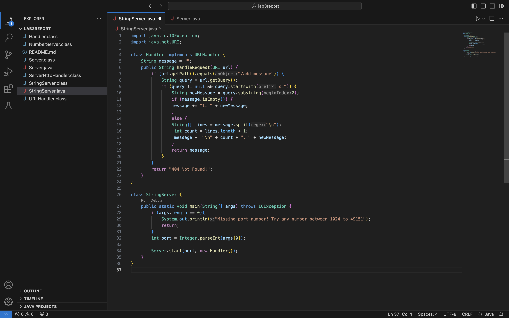
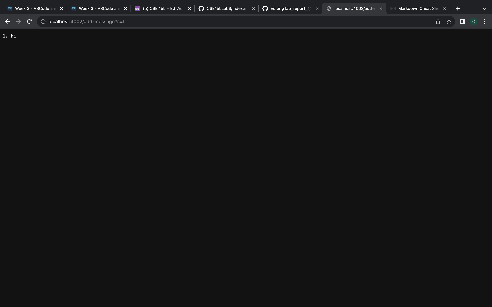
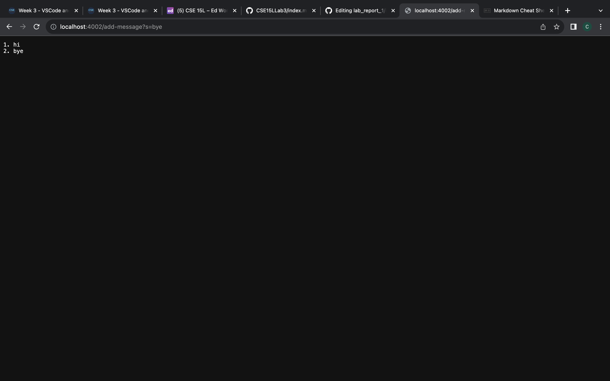
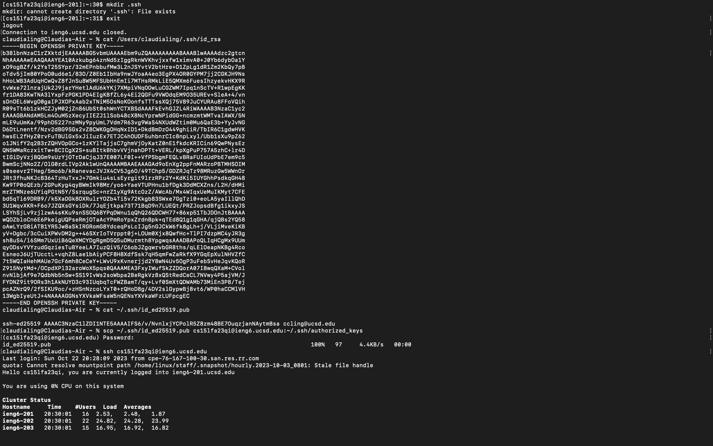

# Lab 2
### Code: 

  

### Output:

  
  

The handleRequest code has relevant arguments taking a URI argument in order to get information of path and query string. A relevant instance variable is the "message" variable where it stores and updates new message request while tracking the count. The message variable checks that the request path is "/add-message" and that the query string starts with "s=". Then, the query string is extracted and the web shows the output of the message and any other updated messages.
The main method is called to run the code, it has implementation of the Handler class which has the handleRequest method that deals with specific message requests. It is ran by a given port number and the server start method is called to start the actual server, using the Handler class to process the requests given.

### Terminal:
The private key is used to access the remote server securely. To access the private key, I called "/Users/claudialing/.ssh/id_rsa"
which displays the OPENSSH PRIVATE KEY which is a unique crypted security key.
The public key uses password authentication to verify the user's identity and is store on the remote server. To access the public key, I called "/.ssh/id_ed25519.pub" which then prompts the user for their password and the server allows the user to log in.
The command "scp ~/.ssh/id_ed25519.pub cs15lfa23qi@ieng6.ucsd.edu:~/.ssh/authorized_keys" allows the user to copy the key to the remote repository and the key is specific to the user in which ieng gives access to the specified users copied key. So, by calling "ssh cs15lfa23qi@ieng6.ucsd.edu" after copying the key to the remote repository, I am able to log into ieng6 with my course specific account without being asked for my password. 

  

Something I learned in week 2 and week 3 is remote servers. I thought it was interesting that they can access my personal laptop from far away. I learned that remote servers can remotely do tasks such as hosting websites. Additionally, I learned that accessing remote servers is public so it is important to have private authentication to them as well.

